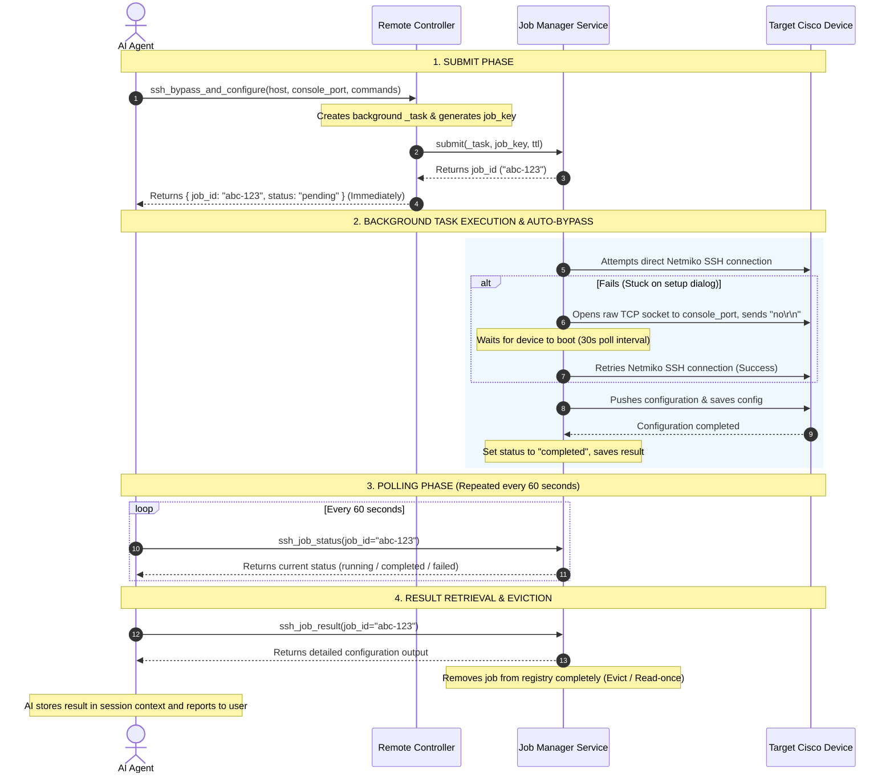
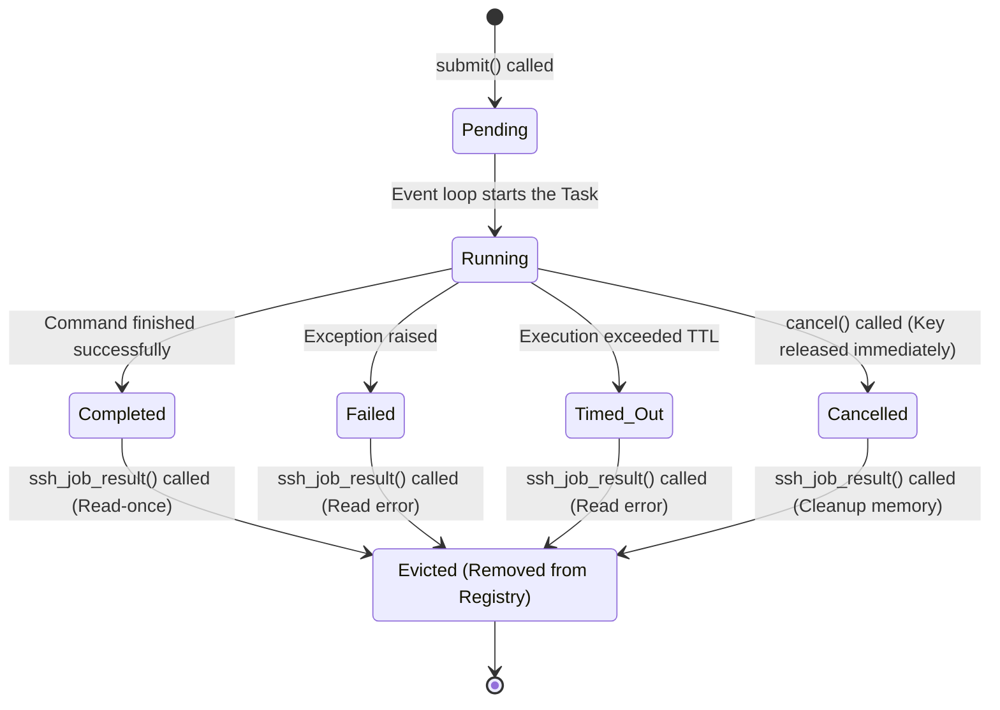

## Objective
To interact directly with the operating system (CLI) of EVE-NG nodes via console, Telnet, or SSH to execute commands and configure features.

---

## IMPORTANT: Command Execution Tools Are Now Async (Job-Based)

All command execution tools (SSH tools: `ssh_run_command`, `ssh_run_commands`, `ssh_configure`, and EVE-NG Remote tools: `remote_command`, `remote_commands`, `remote_config`, `remote_node`) no longer block until completion. They submit the work as a **background job** and return a `job_id` immediately. You **must** poll the status and retrieve the result using the job management tools (`ssh_job_status`, `ssh_job_result`, `ssh_cancel_job`).

### Job Lifecycle

```
ssh_run_command(...) / remote_command(...)  →  { job_id, job_key, status: "pending" }
        │
        ▼  (every 60 seconds)
ssh_job_status(job_id)  →  { status: "running", progress: { percent, message } }
        │
        ▼  (when status == "completed")
ssh_job_result(job_id)  →  { status: "completed", result: { host, command, output } }
```

#### Sequence Diagram



#### State Diagram



### Job Status Values

| Status       | Meaning                                      | Next action                        |
|--------------|----------------------------------------------|------------------------------------|
| `pending`    | Queued, not yet started                      | Poll again in 60 s                 |
| `running`    | SSH session active, command executing        | Poll again in 60 s                 |
| `completed`  | Command finished successfully                | Call `ssh_job_result(job_id)`      |
| `failed`     | SSH or command error occurred                | Call `ssh_job_result(job_id)` to read error |
| `timed_out`  | Job exceeded its TTL                         | Call `ssh_job_result(job_id)` to read error |
| `cancelled`  | Job was cancelled via `ssh_cancel_job`       | Call `ssh_job_result(job_id)` to confirm |

### Mandatory Polling Rule

> **Poll `ssh_job_status(job_id)` every 60 seconds** until `status` is one of:
> `completed`, `failed`, `timed_out`, or `cancelled`.
> Do NOT call `ssh_job_result` before the job is in a terminal state.

### Duplicate Job Guard

Each host (and port, if using console redirection) has a per-operation key lock:
- `ssh:cmd:{host}` or `ssh:cmd:{host}:{port}` — only one single command execution per target at a time.
- `ssh:cmds:{host}` or `ssh:cmds:{host}:{port}` — only one multi-command execution per target at a time.
- `ssh:cfg:{host}` or `ssh:cfg:{host}:{port}` — only one configuration push per target at a time.

If you receive `{"error": "A job with key '...' is already active"}`, wait for the existing job to finish before submitting a new one, or cancel the old job with `ssh_cancel_job(job_id)`.

---

## Step-by-Step Instructions

1. **Verify Prerequisites:**
   * Make sure you are logged in using `eve-authentication` first.
   * Node must be in a `running` state (use `eve-node-management` to check status and start the node if necessary).
     - *Note:* Newly started nodes typically take 5 to 10 minutes to boot up completely. Make sure to wait until the node is fully booted before running commands.

2. **Establish Remote Sessions:**
   * Use `remote_node` to acquire the connection URI (e.g. telnet:// or vnc:// address) for a node console.

3. **Determine and Navigate CLI Modes:**
   * Before executing any configuration or operational commands, always identify the device's current CLI mode by inspecting the prompt (e.g., User EXEC `Router>`, Privileged EXEC `Router#`, or Global Config `Router(config)#`).
   * **⚠️ Unknown or Uncertain Mode — Always Send `end` First:**
     If the current CLI mode **cannot be determined** (ambiguous prompt, fresh connection, after a failed command, or any uncertainty), you **MUST** always send `end` as the very first command before doing anything else. `end` is safe in all modes — it exits any sub-configuration mode and returns the device to Privileged EXEC (`Router#`) without causing errors.
     ```
     end          ← always safe; exits config/sub-config modes, no-op in EXEC mode
     enable       ← escalate to Privileged EXEC if needed
     conf t       ← enter Global Config only when explicitly required
     ```
   * **Reset Session Mode:** Whenever starting a new command execution or configuration block, send `end` first to exit all sub-configuration modes and return to Privileged EXEC mode, then navigate to the target mode.
   * Navigate or escalate to the appropriate mode required for your commands before sending them:
     - Use `enable` to enter privileged EXEC mode.
     - Use `configure terminal` (or `conf t`) to enter global configuration mode.
     - Refer to [Cisco IOS Patterns](/skills/cisco-ios-patterns/SKILL.md) for detail on prompt hierarchies and commands.

4. **Remote Console Operations (Non-SSH / Telnet redirection via remote_node):**
   * Use `remote_node` to execute console commands. This tool is **async and job-based**: it submits the operation to the job manager and returns a `job_id` immediately. Poll and retrieve results via `ssh_job_status` / `ssh_job_result`.
   * **Alternative: Upload Startup Configuration (Highly Reliable):** If interactive console configuration via `remote_node` fails due to Netmiko prompt-matching, EULA, or initialization errors (e.g., `terminal width 511` error):
     - Use `eve-mcp:upload_node_config` to upload and activate (`enable=true`) the startup configuration directly.
     - If the node is currently running, stop the node (`eve-mcp:stop_node`), wipe the node (`eve-mcp:wipe_node`) to clear runtime state, and start it again (`eve-mcp:start_node`). The device will boot directly with the correct configuration.
   * **Bypassing Initial Configuration Dialog (First Boot Gotcha):** Freshly booted devices (e.g. Cisco vIOS L2 switches) often display an initial configuration wizard asking `Would you like to enter the initial configuration dialog? [yes/no]:`.
     - *Problem:* While stuck on this prompt, standard Netmiko/SSH connections will fail with a `Login failed` or timeout error because they expect a standard `Switch>` or `Switch#` prompt.
     - *Solution (Raw Bypass):* Use the `eve-mcp:ssh_bypass_console_dialog` tool to connect via raw TCP socket and send `no` to bypass the prompt. Note: You must wait 3-5 minutes after running this bypass before proceeding with further tool executions.
     - *Solution (Preferred One-Shot):* Alternatively, you can use the one-shot bypass-and-run tools: `eve-mcp:ssh_bypass_and_configure`, `eve-mcp:ssh_bypass_and_run_command`, or `eve-mcp:ssh_bypass_and_run_commands`. These tools will automatically try Netmiko first, bypass the console dialog if they fail, wait and retry automatically, and execute your commands as a single background job.
     - *Important:* After the bypass completes, you must set the hostname of the device before proceeding with other configurations.
   * **Configuring VPCS Nodes (`vpcs` template):**
     - VPCS nodes are lightweight emulators and do NOT support Cisco-specific initialization commands (like `terminal width` or `terminal length`).
     - When configuring VPCS nodes, set the Netmiko `device_type` to `generic_telnet` and only run VPCS-compatible commands (e.g., `ip dhcp` to obtain IP, `save` to save config, `ping` to test connectivity).
     - If standard Netmiko telnet fails due to prompt scraping issues on VPCS (`PC1>`), send an empty string `""` command first to wake up the prompt, or use raw socket telnet connections as a fallback.

5. **Async Command Execution Job Flow:**

   **Step 5a – Submit the background job:**
   * Call the tool: `ssh_run_command`, `ssh_run_commands`, `remote_command`, `remote_commands`, or `remote_node` with the appropriate parameters.
   * The tool returns immediately with a payload:
     ```json
     { "job_id": "abc-123", "job_key": "ssh:cmd:192.168.1.1", "status": "pending" }
     ```
   * *Critical Note:* Save this `job_id` for use in subsequent steps.
   * *⚠️ Duplicate Lock Warning:* Each target device/console has a concurrency guard using `job_key`. If you receive a `DuplicateJobError`, **do NOT** resubmit the command. You must wait for the active job to finish or call `ssh_cancel_job` to cancel the old job first.

   **Step 5b – Poll status periodically:**
   * Periodically **every 60 seconds**, call the `ssh_job_status` tool with your `job_id`:
     ```json
     ssh_job_status(job_id="abc-123")
     ```
   * The response will show progress:
     ```json
     { "status": "running", "progress": { "percent": 50, "message": "Executing command..." } }
     ```
   * *Critical Note:* **You must wait at least 60 seconds** between polling attempts. Do NOT spam calls continuously (throttling) to avoid overload. Wait until the `status` changes to a terminal state (`completed`, `failed`, `timed_out`, or `cancelled`).

   **Step 5c – Retrieve the final result (Retrieve & Evict):**
   * Once the status is terminal, call `ssh_job_result` to read the output:
     ```json
     ssh_job_result(job_id="abc-123")
     ```
   * *Critical Note (Read-Once Eviction):* The `ssh_job_result` method is a **read-once operation**. Immediately after returning the results, the job is evicted (deleted) from memory. Thus, you **must store this result immediately** in your active session context. Any subsequent call with the same ID will raise a `JobNotFoundError`.

   **Step 5d – Handling execution failures:**
   * If a job fails or times out (`failed` or `timed_out` status), call `ssh_job_result` to inspect the detailed `error` message.
   * Analyze the root cause (e.g., authentication failure, connection timeout), report to the user, and get permission before resubmitting.

6. **Async Configuration Flow:**
   * Use `ssh_configure`, `remote_config`, or the auto-bypass variant `ssh_bypass_and_configure`.
   * The submission, 60-second polling loop, and result retrieval processes are identical to **Step 5** above.
   * *Note:* Configuration tasks can take longer (especially when `save_config=true`), so ensure appropriate timeouts and poll patiently.

7. **Cancelling a Running Job:**
   * If a job is hung, taking too long, or no longer needed, call:
     ```json
     ssh_cancel_job(job_id="abc-123")
     ```
   * *Note:* Cancellation releases the `job_key` lock immediately so you can submit a new job. However, the old job remains in memory under `cancelled` status. You **must** call `ssh_job_result` once to fully clean up (evict) the cancelled job from the system registry.

8. **Handling MCP Failures:**
   * **CRITICAL:** When encountering an error on the MCP (Server/Tool) side that cannot be fixed, you must stop immediately and notify the user. Under no circumstances should you create standalone scripts or code to run outside the MCP system.

---

## Context & Tools

| Tool | Description |
|---|---|
| `eve-mcp:remote_node` | Connect via console port and execute commands as a background job → returns `job_id` |
| `eve-mcp:upload_node_config` / `eve-mcp:enable_node_config` | Upload and enable startup configurations |
| `eve-mcp:remote_command` | Send single command to a node via SSH as a background job → returns `job_id` |
| `eve-mcp:remote_commands` | Send sequence of commands via SSH as a background job → returns `job_id` |
| `eve-mcp:remote_config` | Apply configuration commands via SSH as a background job → returns `job_id` |
| `eve-mcp:ssh_run_command` | Submit single SSH exec command as background job → returns `job_id` |
| `eve-mcp:ssh_run_commands` | Submit multiple SSH exec commands as background job → returns `job_id` |
| `eve-mcp:ssh_configure` | Submit SSH config push as background job → returns `job_id` |
| `eve-mcp:ssh_job_status` | Poll job status every 60 s; returns `status`, `progress`, `error` |
| `eve-mcp:ssh_job_result` | Retrieve final result and evict job from memory (read-once) |
| `eve-mcp:ssh_cancel_job` | Cancel a running job; releases `job_key` immediately |
| `eve-mcp:ssh_bypass_console_dialog` | Connect via raw TCP socket and bypass Cisco dialog immediately |
| `eve-mcp:ssh_bypass_and_run_command` | Auto-bypass Cisco dialog and execute single command (async job) |
| `eve-mcp:ssh_bypass_and_run_commands` | Auto-bypass Cisco dialog and execute list of commands (async job) |
| `eve-mcp:ssh_bypass_and_configure` | Auto-bypass Cisco dialog and push configuration (async job) |
